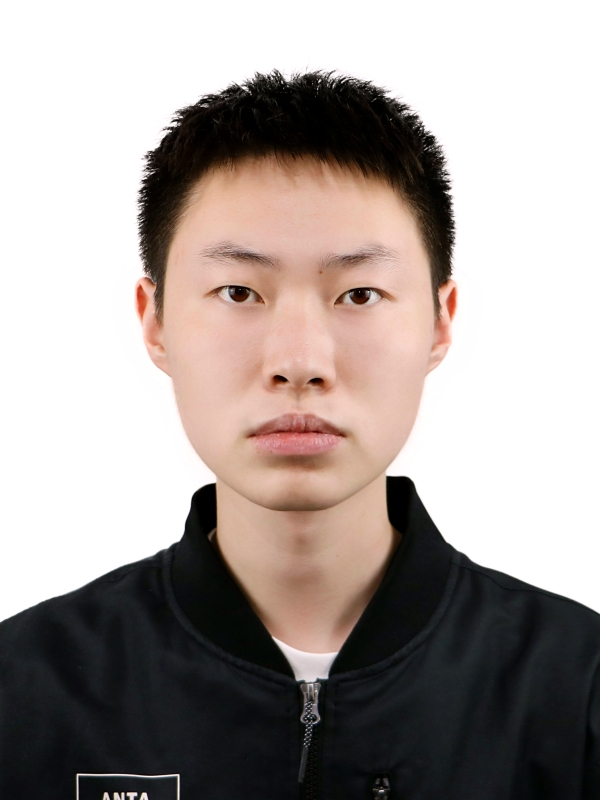
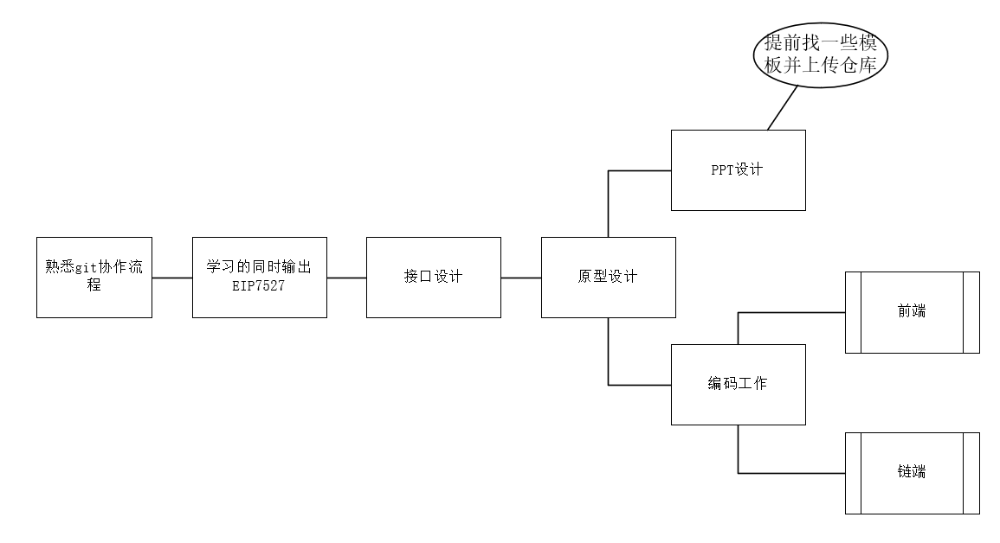

[TOC]

# 官网信息

**🦅 Twitter:**  https://twitter.com/Lotloot_gamefi

**🌎 Website:**  https://lot-loot.vercel.app/

💬 github: https://github.com/cuitFreeKingdom/LotLoot

✅ gitee: https://gitee.com/du-mingsong/warp-hack-thon （latest）

✅ 白皮书: https://gitee.com/du-mingsong/warp-hack-thon/blob/master/%E7%99%BD%E7%9A%AE%E4%B9%A6.md （latest）

✅ whitePaper：https://gitee.com/du-mingsong/warp-hack-thon/blob/master/WhitePaper.md

# 项目规范

## 协作模式

协助利用 gitflow 模型，sourcetree 可视化工具进行协作

具体模型参考文件

> \doc\DMS_DOC\团队协作\Git 之 GitFlow 工作流.html

## 资料共享模式

根目录下的 readme 如需更改先给我说一下

doc 下属于自己的目录随便修改

**注意事项**

```
1.markdown 引用的图片统一存放在md文件所在目录下的img里面 (统一一下不然后面目录可能出问题
2.创建目录之后尽可能的写README文档,特别是一些工程文件的启动方法等。
```

# hackthon 资料

[1.Arweave 亚洲 Hackthon 视频](https://www.bilibili.com/video/BV1se411d7mK/?spm_id_from=333.337.search-card.all.click&vd_source=64bfabbf3acac36984d9c1de9d632975)

2.[demo 项目](https://github.com/wangshouh/EIP7527)

3.[wrap 生命周期](https://hackmd.io/@wongssh/AgentWrap)

4.[项目方宣讲录屏](https://pan.baidu.com/s/1djVDixRaE5bBsRi1LZxZWw?pwd=9aee)

## 黑客松要求

[Link1](https://ethereum-magicians.org/t/erc-7527-token-bound-function-oracle-amm-contract/15950)

[Link2](https://github.com/ethereum/ERCs/pull/70/files#diff-4d79c38c79c9f9302f58ffa038c5d84d3d574cc8e7b00b90d44c4d7d8a8bcd02)

![8M${AR7GO`OL4~1[]~UF4ZY_tmb](img/8M$%7BAR7GO%60OL41%5B%5DUF4ZY_tmb.jpg)


## 初代停车游戏

[仓库地址](https://github.com/WeDAOLabs/ParkingSpaceBattle.git)

[试玩地址](https://lotloot.osairo.xyz)

[创新玩法](https://gitee.com/du-mingsong/warp-hack-thon/tree/master/doc/DMS_DOC/park/现有规则的一点思考.md)

# 任务进度及分工情况

### 个人介绍

大家先把自己的资料放在这个位置，方便做 ppt 的同学使用（统一格式，白底照片）

**杜明松**:


全栈系统工程师，成都信息工程大学前区块链创新开发实验室成员，Async Lab 实验室成员，擅长 web 构建及渗透，在校期间和小伙伴们一起获第十七届四川大学生计算机作品赛特等奖，第十五届全国大学生信息安全竞赛三等奖，第十七届泛珠三角+大学生计算机作品赛总决赛三等奖等奖项，具有丰富的项目管理经验。

**万艳**：


UI 设计，软件工程专业在读，熟悉软件项目管理流程。有丰富的 UI 设计经验，参与并主导 4 个项目的需求分析与原型设计工作。2020 至 2021 年度国家奖学金获得者，有敏锐的商业头脑，多次在创新创业大赛中取得成绩。

**陈思达**:


后端/合约工程师，区块链工程专业在读，校内区块链信创实验室成员，校内 Async Lab 实验室成员，校内区块链智能治理社区成员。擅长 Go 语言后端开发工作，对于 Solidity 开发也比较了解。曾获四川省区块链技术创新应用大赛应用组一等奖，浙江大学第三届链坊杯 gamefi / NFT 赛道三等奖。

**亓祺**:



前端工程师，软件工程专业在读，校内 Loop 实验室成员。熟悉软件开发测试流程，擅长 JavaScript 语言开发工作，对于 Web3 开发较为了解。曾参与并主导开发多个软件项目的开发，具有丰富的软件开发经验。

**张力子**：


前端/智能合约工程师，区块链工程专业在读，成都信息工程大学区块链网络安全中心成员。擅长 Vue.js 框架、Solidity、Java 语言。具备较强创新能力、项目设计能力，具有项目开发管理经验，丰富大赛经验。曾获大学生互联网+铜奖，四川区块链职业技能大赛优秀案例等奖项。

**章茗茜**：


智能合约工程师，区块链工程专业在读，成都信息工程大学区块链网络安全中心成员。擅长 solidity 语言，具有基于以太坊的智能合约开发能力，了解脚本语言 python、JavaScript，了解常见的智能合约漏洞原理及其修复方式，有合约审计相关经验。曾获第二届中国可信区块链安全攻防大赛三等奖等奖项。

**周正**：


智能合约工程师，区块链工程专业在读，成都信息工程大学区块链协会创始人之一。了解 solidity，JS，python 爬虫，逆向等技术，有合约开发经验，了解合约基本漏洞及其修复，以及复现过 UniswapV2，opensea 等以太坊知名项目源码。曾获 eth 杭州 L2 赛道第二名，miniHack house 第三名。

### 进度推进模式

第一阶段

从现在开始，大家先开始学习，在本地进行 demo 实验但是不上仓库，偶尔开个会讨论一下。在大家感觉学的差不多了可以开始的时候在开始分工然后进入开发阶段，ppt 预计在第一阶段的中后期开始做（ppt 模板选择和类似团队介绍这种部分可以在此时开始搞）



# 激励分配

现在的初步想法是分为开发组和产品组

开发组主要负责系统开发和实现，协作产品组完成工作

产品组主要负责 PPT，文档编写，原型图等工作

项目无保底，比赛奖金作为唯一资金来源，开发组和产品组各分得一定权重，组内再按照贡献分出不同的权重分成（开发组的 commit 情况作为分配标准之一）
